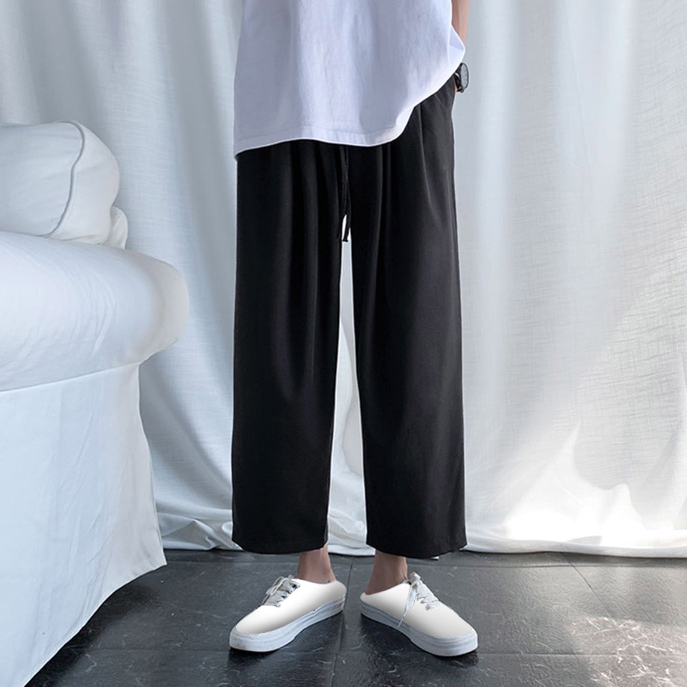
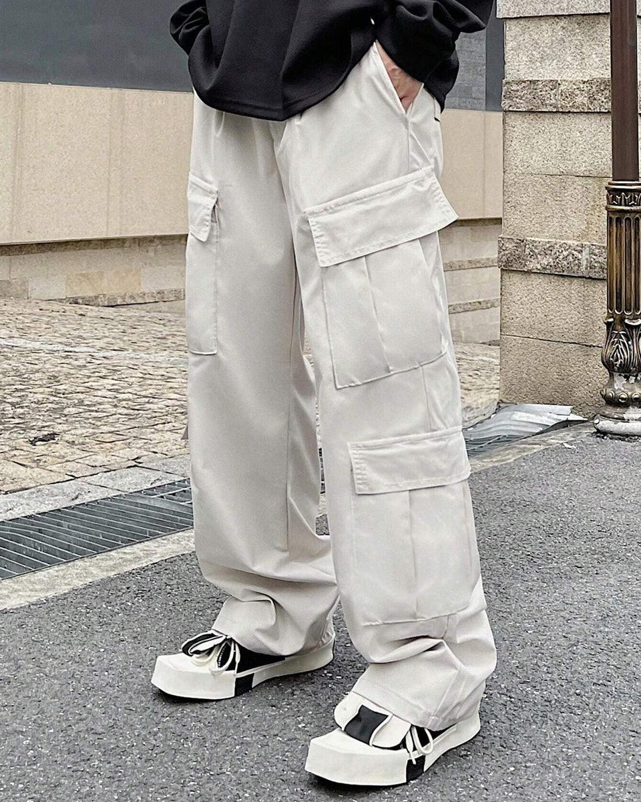
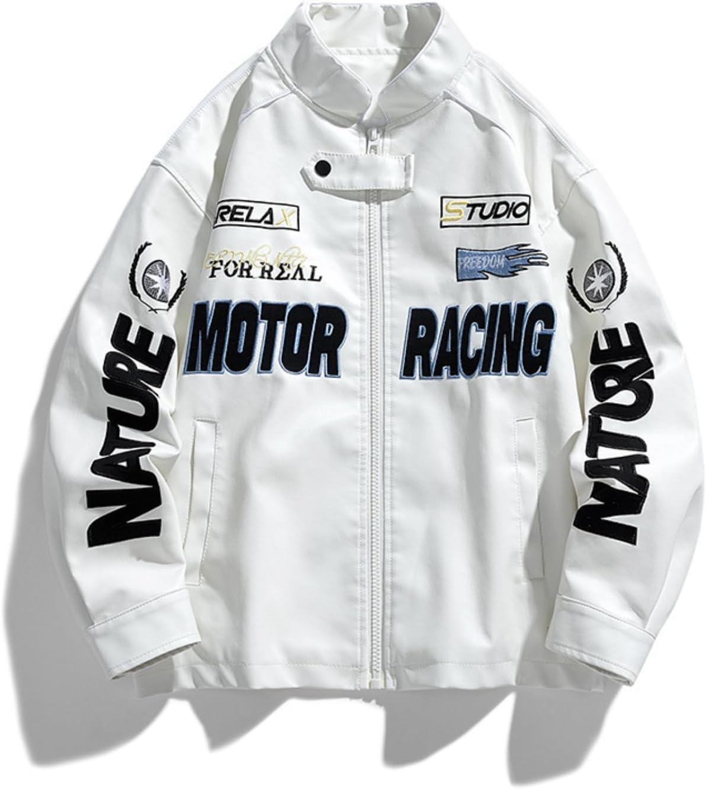
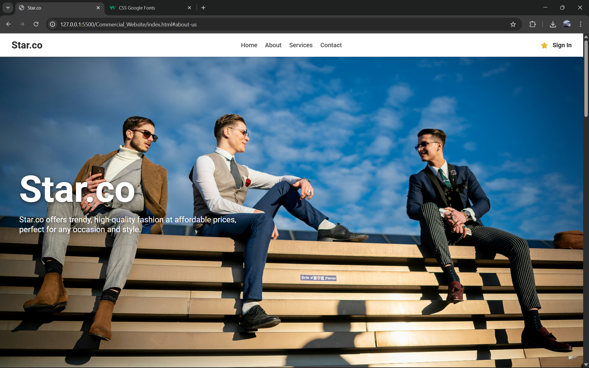
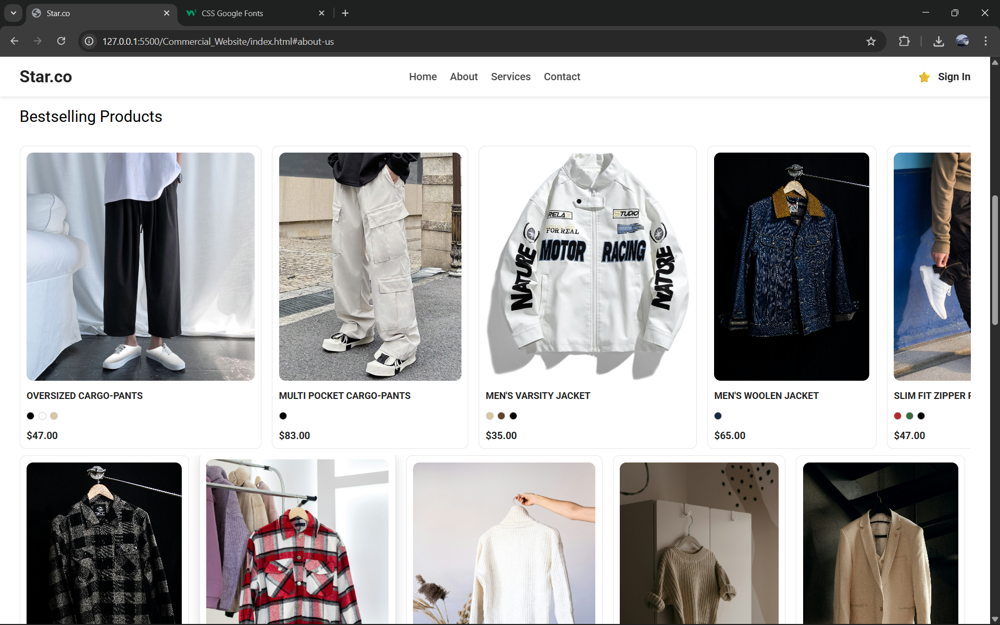
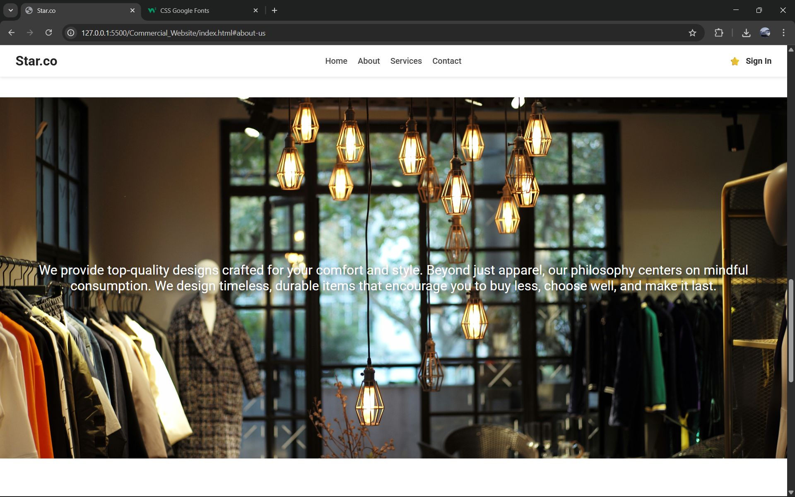
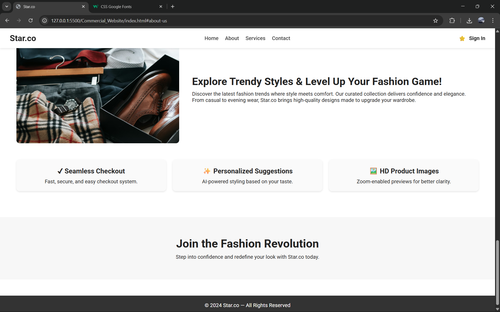

# Ex02 Commercial Website
## Date: 02-12-2025

## AIM
To create a commercial website using CSS Flexbox.

## ALGORITHM
### STEP 1
Create an HTML file (index.html)

### STEP 2
Create a CSS file (style.css)

### STEP 3
Include a navigation bar with links to different sections.

### STEP 4
Add structured sections for Homepage, Products / Services, About Us, Contact Details and User Account.

### STEP 5
Include social media links at the footer with copyright information.

### STEP 6
Define global styles for fonts, colors, and layout.

### STEP 7
Style the header, navigation bar, and sections.

### STEP 8
Use Flexbox for layout design.

### STEP 9
Add hover effects and transitions for interactivity.

### STEP 10
Add Images and Media.

### STEP 11
Use optimized images for a professional look.

### STEP 12
Open the HTML file in a browser to check layout and functionality.

### STEP 13
Fix styling issues and refine content placement.

### STEP 14
Deploy the website.

### STEP 15
Upload to GitHub Pages for free hosting.

## PROGRAM

### index.html
```html
<!DOCTYPE html>
<html lang="en">
<head>
    <meta charset="UTF-8" />
    <meta name="viewport" content="width=device-width, initial-scale=1.0" />
    <title>Star.co</title>
    <link rel="stylesheet" href="styles.css" />
    <link
        href="https://fonts.googleapis.com/css2?family=Roboto:wght@300;400;500;700&display=swap"
        rel="stylesheet"
    />
</head>
<body>
    <header>
        <nav>
            <div class="logo">Star.co</div>
            <ul>
                <li><a href="#hero">Home</a></li>
                <li><a href="#about-us">About</a></li>
                <li><a href="#content-info">Services</a></li>
                <li><a href="#contact">Contact</a></li>
            </ul>
            <div class="nav-btns"><span>⭐</span><span>Sign In</span></div>
        </nav>
    </header>

    <main>
        <section class="hero">
            <h1>Star.co</h1>
            <p>
                Star.co offers trendy, high-quality fashion at affordable prices,<br />
                perfect for any occasion and style.
            </p>
        </section>

        <section class="products">
            <p>Bestselling Products</p>

            <div class="product-container">

                <div class="product-card">
                    
                    <h4>OVERSIZED CARGO-PANTS</h4>
                    <div class="color-options">
                        <span class="color black"></span>
                        <span class="color white"></span>
                        <span class="color beige"></span>
                    </div>
                    <p class="price">$47.00</p>
                </div>

                <div class="product-card">
                    
                    <h4>MULTI POCKET CARGO-PANTS</h4>
                    <div class="color-options">
                        <span class="color black"></span>
                    </div>
                    <p class="price">$83.00</p>
                </div>

                <div class="product-card">
                    
                    <h4>MEN'S VARSITY JACKET</h4>
                    <div class="color-options">
                        <span class="color beige"></span>
                        <span class="color brown"></span>
                        <span class="color black"></span>
                    </div>
                    <p class="price">$35.00</p>
                </div>

                <div class="product-card">
                    
                    <h4>MEN'S WOOLEN JACKET</h4>
                    <div class="color-options">
                        <span class="color navy"></span>
                    </div>
                    <p class="price">$65.00</p>
                </div>

                
                <div class="product-card">
                    
                    <h4>SLIM FIT ZIPPER PANTS </h4>
                    <div class="color-options">
                        <span class="color red"></span>
                        <span class="color green"></span>
                        <span class="color black"></span>
                    </div>
                    <p class="price">$47.00</p>
                </div>

                <div class="product-card">
                    
                    <h4>SOLID BLAZER</h4>
                    <div class="color-options">
                        <span class="color black"></span>
                    </div>
                    <p class="price">$83.00</p>
                </div>

                <div class="product-card">
                    
                    <h4></h4>
                    <div class="color-options">
                        <span class="color beige"></span>
                        <span class="color brown"></span>
                        <span class="color black"></span>
                    </div>
                    <p class="price">$35.00</p>
                </div>

                <div class="product-card">
                    
                    <h4>MEN'S WOOLEN JACKET</h4>
                    <div class="color-options">
                        <span class="color navy"></span>
                    </div>
                    <p class="price">$65.00</p>
                </div>
            </div>
            <div class="product-container">

                <div class="product-card">
                    
                    <h4>CHECKED SHIRT</h4>
                    <div class="color-options">
                        <span class="color red"></span>
                        <span class="color green"></span>
                        <span class="color black"></span>
                    </div>
                    <p class="price">$47.00</p>
                </div>

                <div class="product-card">
                    
                    <h4>CHECKED SHIRT</h4>
                    <div class="color-options">
                        <span class="color black"></span>
                    </div>
                    <p class="price">$83.00</p>
                </div>

                <div class="product-card">
                    
                    <h4>TURTLE NECK T-SHIRT</h4>
                    <div class="color-options">
                        <span class="color beige"></span>
                        <span class="color brown"></span>
                        <span class="color black"></span>
                    </div>
                    <p class="price">$35.00</p>
                </div>

                <div class="product-card">
                    
                    <h4>COTTON KNITTED T-SHIRT</h4>
                    <div class="color-options">
                        <span class="color navy"></span>
                    </div>
                    <p class="price">$65.00</p>
                </div>

                
                <div class="product-card">
                    
                    <h4>SOLID BLAZER</h4>
                    <div class="color-options">
                        <span class="color red"></span>
                        <span class="color green"></span>
                        <span class="color black"></span>
                    </div>
                    <p class="price">$47.00</p>
                </div>

                <div class="product-card">
                    
                    <h4>MEN'S OVERSIZED ZIP‑UP</h4>
                    <div class="color-options">
                        <span class="color black"></span>
                    </div>
                    <p class="price">$83.00</p>
                </div>

                <div class="product-card">
                    
                    <h4>MEN'S WIDE‑FIT TROUSERS</h4>
                    <div class="color-options">
                        <span class="color beige"></span>
                        <span class="color brown"></span>
                        <span class="color black"></span>
                    </div>
                    <p class="price">$35.00</p>
                </div>

                <div class="product-card">
                    
                    <h4>MEN'S RELAXED BAGGY JEANS</h4>
                    <div class="color-options">
                        <span class="color navy"></span>
                    </div>
                    <p class="price">$65.00</p>
                </div>
            </div>
        </section>

        <section class="about-us">
            <p>
                We provide top-quality designs crafted for your comfort and style.
                Beyond just apparel, our philosophy centers on mindful consumption.
                We design timeless, durable items that encourage you to buy less,
                choose well, and make it last.
            </p>
        </section>

        <section class="content-info">
            <div class="info-box">
                
                <div class="info-text">
                    <h3>Explore Trendy Styles & Level Up Your Fashion Game!</h3>
                    <p>
                        Discover the latest fashion trends where style meets comfort.
                        Our curated collection delivers confidence and elegance.
                    </p>
                    <p>
                        From casual to evening wear, Star.co brings high-quality
                        designs made to upgrade your wardrobe.
                    </p>
                </div>
            </div>

            <div class="info-box features">
                <div class="tiles">
                    <h4>✔ Seamless Checkout</h4>
                    <p>Fast, secure, and easy checkout system.</p>
                </div>
                <div class="tiles">
                    <h4>✨ Personalized Suggestions</h4>
                    <p>AI-powered styling based on your taste.</p>
                </div>
                <div class="tiles">
                    <h4>🖼️ HD Product Images</h4>
                    <p>Zoom-enabled previews for better clarity.</p>
                </div>
            </div>
        </section>

        <section class="cta">
            <h2>Join the Fashion Revolution</h2>
            <p>Step into confidence and redefine your look with Star.co today.</p>
        </section>
    </main>

    <footer>
        <p>© 2024 Star.co — All Rights Reserved</p>
    </footer>
</body>
</html>
```

### styles.css
```css
/* Product Card System */
.product-card {
  min-width: 260px;
  background: #fff;
  border-radius: 10px;
  display: flex;
  flex-direction: column;
  gap: 10px;
  padding: 10px;
  scroll-snap-align: start;
  flex-shrink: 0;
  transition: 0.3s ease;
  border: 1px solid #e6e6e6;
  cursor: pointer;
}

.product-card:hover {
  transform: translateY(-5px);
  box-shadow: 0px 6px 18px rgba(0,0,0,0.15);
}

.product-card img {
  width: 100%;
  height: 350px; /* portrait e‑commerce ratio */
  object-fit: cover;
  border-radius: 10px;
}

.product-card h4 {
  font-size: 0.9rem;
  font-weight: 600;
  color: #222;
  text-transform: uppercase;
  margin-top: 5px;
  line-height: 1.3;
}

.price {
  font-weight: 600;
  font-size: 0.95rem;
  margin-top: 5px;
}

/* Color Dot System */
.color-options {
  display: flex;
  gap: 6px;
  margin-top: 5px;
}

.color {
  width: 12px;
  height: 12px;
  border-radius: 50%;
  border: 1px solid #ccc;
}

/* Custom swatch colors */
.color.black { background: #000; }
.color.red { background: #b32a2a; }
.color.green { background: #376e3f; }
.color.beige { background: #d9c6a2; }
.color.brown { background: #5c4632; }
.color.navy { background: #1b2a44; }

* {
  margin: 0;
  padding: 0;
  box-sizing: border-box;
}

body {
  font-family: 'Roboto', sans-serif;
  color: #222;
  background: #fff;
}

/* NAVBAR */
nav {
  display: flex;
  justify-content: space-between;
  align-items: center;
  padding: 15px 30px;
  background: #fff;
  box-shadow: 0 2px 6px rgba(0, 0, 0, 0.1);
  position: fixed;
  width: 100%;
  top: 0;
  z-index: 1000;
}

nav .logo {
  font-size: 1.6rem;
  font-weight: 700;
}

nav ul {
  display: flex;
  gap: 20px;
  list-style: none;
}

nav ul a {
  text-decoration: none;
  color: #444;
  font-weight: 500;
  transition: 0.3s;
}

nav ul a:hover {
  color: #000;
}

.nav-btns {
  display: flex;
  align-items: center;
  gap: 10px;
  cursor: pointer;
  font-weight: 600;
}

/* HERO */
.hero {
  height: 100vh;
  background: url('assets/hero.jpg') center/cover no-repeat;
  display: flex;
  flex-direction: column;
  justify-content: center;
  padding-left: 50px;
  color: white;
  text-shadow: 2px 2px 10px rgba(0, 0, 0, 0.7);
}

.hero h1 {
  font-size: 6rem;
  margin-bottom: 10px;
}

.hero p {
  font-size: 1.3rem;
  max-width: 600px;
}

/* PRODUCTS **/
.products > p{
  margin-bottom: 30px;
  font-size: 1.5rem;
  color: #000000;
}
.products {
  padding: 60px 30px;
}

.products h2 {
  margin-bottom: 15px;
  font-size: 2rem;
}

.product-container {
  display: flex;
  gap: 16px;
  overflow-x: auto;
  scroll-snap-type: x mandatory;
  padding-bottom: 10px;
}

.product-container::-webkit-scrollbar {
  display: none;
}

.product {
  min-width: 250px;
  height: 320px;
  background: #eee;
  border-radius: 10px;
  display: flex;
  justify-content: center;
  align-items: center;
  font-size: 1.2rem;
  scroll-snap-align: start;
  flex-shrink: 0;
}

/* ABOUT SECTION */
.about-us {
  background: url('assets/shop.jpg') center/cover;
  height: 80vh;
  display: flex;
  align-items: center;
  justify-content: center;
  text-align: center;
  padding: 20px;
  font-size: 1.6rem;
  color: white;
  text-shadow: 2px 2px 10px rgba(0, 0, 0, 0.6);
}

/* CONTENT INFO */
.content-info {
  padding: 50px;
  margin-top: 50px;
}

.info-box {
  display: flex;
  gap: 20px;
  margin-bottom: 30px;
  flex-wrap: wrap;
}

.info-img {
  flex: 1;
  max-width: 500px;
  border-radius: 10px;
}

.info-text {
  flex: 2;
  display: flex;
  flex-direction: column;
  justify-content: center;
  padding: 20px;
}

.info-text h3 {
  font-size: 2rem;
  margin-bottom: 10px;
}

/* TILES */
.features {
  justify-content: space-between;
  margin-top: 50px;
}

.tiles {
  flex: 1;
  background: #fafafa;
  padding: 20px;
  border-radius: 10px;
  text-align: center;
  box-shadow: 0 2px 5px rgba(0, 0, 0, 0.1);
  min-width: 250px;
}

.tiles h4 {
  margin-bottom: 10px;
  font-size: 1.3rem;
}

/* CTA SECTION */
.cta {
  text-align: center;
  padding: 60px 20px;
  background: #f7f7f7;
}

.cta h2 {
  font-size: 2.2rem;
  margin-bottom: 10px;
}

/* FOOTER */
footer {
  background: #333;
  padding: 20px;
  text-align: center;
  color: white;
  margin-top: 50px;
}
```

## OUTPUT









## RESULT
The program for creating commercial website using CSS Flexbox is executed successfully.
